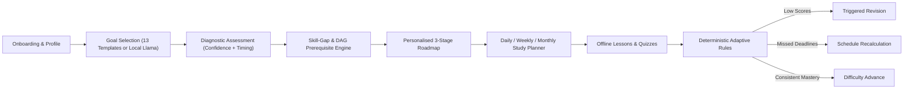
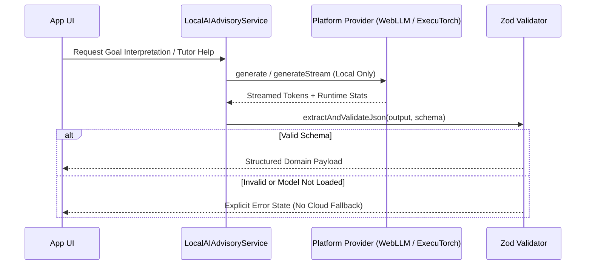

# System Flowcharts — AI Learning Companion

## 1. Learner Diagnosis -> Roadmap -> Adaptive Schedule Flow

```mermaid
flowchart LR
  ONB["Onboarding & Profile"] --> GOAL["Goal Selection (13 Templates or Local Llama)"]
  GOAL --> DIAG["Diagnostic Assessment (Confidence + Timing)"]
  DIAG --> GAP["Skill-Gap & DAG Prerequisite Engine"]
  GAP --> ROAD["Personalised 3-Stage Roadmap"]
  ROAD --> PLAN["Daily / Weekly / Monthly Study Planner"]
  PLAN --> LEARN["Offline Lessons & Quizzes"]
  LEARN --> ADAPT["Deterministic Adaptive Rules"]
  ADAPT -->|Low Scores| REV["Triggered Revision"]
  ADAPT -->|Missed Deadlines| REPLAN["Schedule Recalculation"]
  ADAPT -->|Consistent Mastery| ADV["Difficulty Advance"]
```

## 2. Local Llama Inference & Validation Flow

```mermaid
sequenceDiagram
  participant UI as App UI
  participant SVC as LocalAIAdvisoryService
  participant PROV as Platform Provider (WebLLM / ExecuTorch)
  participant VAL as Zod Validator

  UI->>SVC: Request Goal Interpretation / Tutor Help
  SVC->>PROV: generate / generateStream (Local Only)
  PROV-->>SVC: Streamed Tokens + Runtime Stats
  SVC->>VAL: extractAndValidateJson(output, schema)
  alt Valid Schema
    VAL-->>UI: Structured Domain Payload
  else Invalid or Model Not Loaded
    VAL-->>UI: Explicit Error State (No Cloud Fallback)
  end
```
